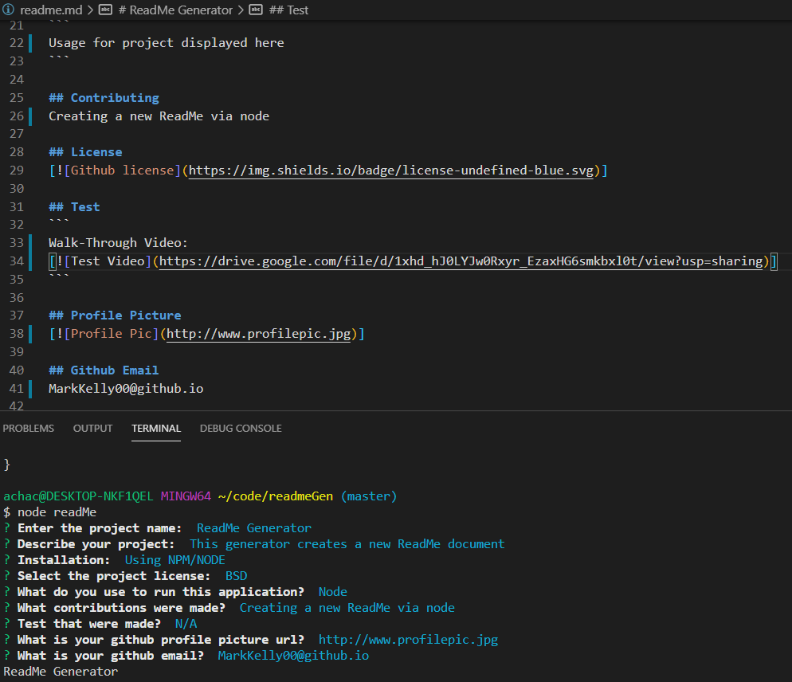

[]
# ReadMe Generator

## Description
This generator creates a new ReadMe document

## Table of contents
* [Installation](#installation)
* [Usage](#usage)
* [Contributing](#contributing)
* [License](#license)
* [Test](#test)
* [Profiel Picture](#profilePic)
* [Github Email](#profileEmail)

## Installation
Ex: Using NPM/NODE

## Usage
```
Usage for project displayed here
```

## Contributing
Creating a new ReadMe via node

## License
[]

## Test

Walk-Through Video:
https://drive.google.com/file/d/1xhd_hJ0LYJw0Rxyr_EzaxHG6smkbxl0t/view?usp=sharing



## Profile Picture
[]

## Github Email
MarkKelly00@github.io
